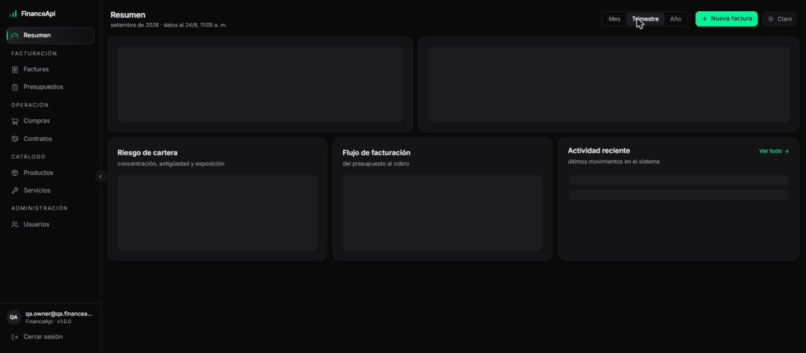
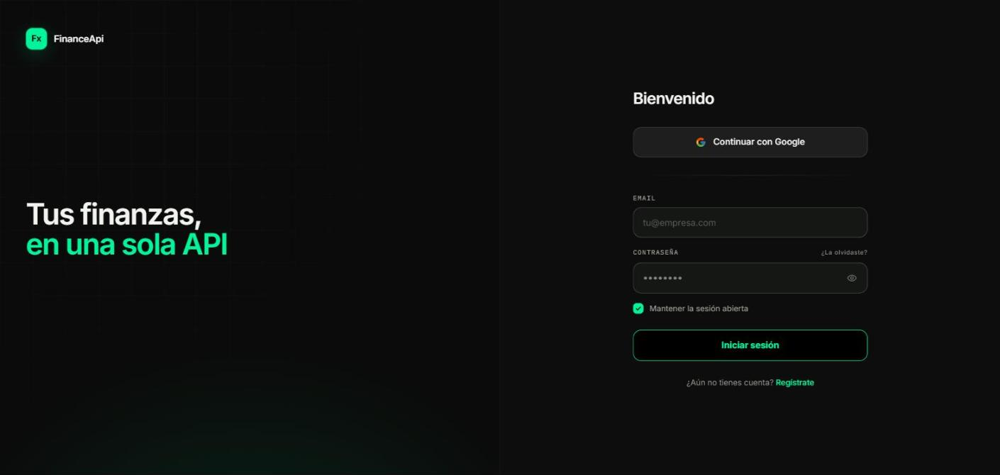
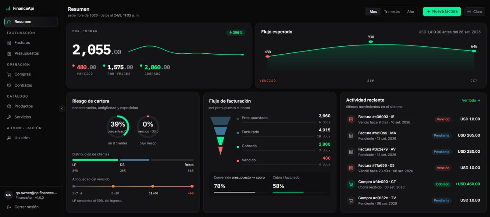

# FinanceApi V3

A full-stack financial management platform built with **NestJS, PostgreSQL, Prisma and Next.js**.

FinanceApi centralizes customers, products, purchases, budgets, invoices and service contracts in a system designed around **authentication, authorization, financial data integrity and transactional consistency**.

## Demo

<!-- Replace this image with the final product demo GIF/video -->


**Live application:** [Add deployment URL]  
**API documentation:** [Add Swagger URL]

---

## What I built

FinanceApi was built as a practical financial management system rather than a simple CRUD application.

The project focuses on the problems that appear when financial information is stored and processed across different modules:

- Protecting access to business information.
- Managing different user roles and permissions.
- Preventing unauthorized access to another user's resources.
- Keeping monetary calculations consistent.
- Avoiding duplicate financial operations caused by network retries.
- Preserving historical transaction prices.
- Keeping multi-step database operations atomic.
- Providing a frontend that consumes the API through a controlled authentication flow.

The result is a complete system with a **Next.js frontend**, **NestJS REST API** and **PostgreSQL database**.

---

## Product Preview

### Login



Authentication is handled through the API with access and refresh token flows.

### Dashboard



The dashboard provides an overview of the application's financial information and key metrics.

### Financial operations


The application includes interfaces for managing products, purchases, budgets, invoices and other business resources.

> Screenshots show the real application interface. No mockup data or fictional product screens are used in the project documentation.

---

## Core Features

### Authentication

- Email/password authentication.
- JWT access tokens.
- Refresh tokens.
- Refresh token rotation.
- Reuse detection.
- Session revocation.
- Protected API endpoints.
- HTTP-only cookie for the refresh token in the web application.

### Authorization

- Role-based access control.
- Fine-grained permissions.
- Resource ownership enforcement.
- Default-deny authorization.
- Protected routes with NestJS guards.
- User role and permission management.

### Financial management

- Customers.
- Product catalog.
- Purchases.
- Budgets.
- Invoices.
- Service contracts.
- Dashboard information.
- Financial transaction history.

### Data integrity

- Monetary values stored as integer cents instead of floating-point numbers.
- Database transactions for multi-table operations.
- Historical price snapshots for transaction line items.
- Idempotency keys on payment-critical operations.
- Relational constraints through PostgreSQL and Prisma.

---

## Engineering Highlights

### Money as integers

Financial amounts are stored as integer cents rather than floating-point values.

```text
$125.50 → 12550 cents
```

This avoids the class of binary floating-point rounding problems that can affect financial calculations.

---

### Idempotency

Payment-critical operations support an optional `Idempotency-Key` header.

This allows the API to safely handle network retries without accidentally creating duplicate financial records.

```http
POST /purchases
Idempotency-Key: purchase-123456
```

---

### Transaction snapshots

Purchase and invoice line items preserve the price that existed when the transaction was created.

Changing the current product price does not modify historical financial records.

```text
Product
Current price: $18.00

Purchase created
Price snapshot: $15.00

Later product update
Current price: $20.00

Historical purchase
Still: $15.00
```

---

### Database transactions

Operations that modify multiple related records are executed inside Prisma transactions.

This prevents partial writes when one step of an operation fails.

```text
Operation
   │
   ├── Create purchase
   ├── Create line items
   ├── Update inventory
   └── Commit
        │
        └── All changes succeed together
```

---

### Authorization layers

Authorization is not based only on the user's role.

The API combines:

```text
JWT Authentication
       ↓
Role Authorization
       ↓
Permission Authorization
       ↓
Resource Ownership
       ↓
Controller / Service
```

This allows the system to distinguish between:

- Who the user is.
- What role they have.
- What permissions they have.
- Whether they own or can access the requested resource.

---

## Architecture

```text
┌───────────────────────────────┐
│         Next.js Web           │
│                               │
│ Dashboard · CRUD · Auth UI    │
└───────────────┬───────────────┘
                │
                │ HTTP / REST
                ▼
┌───────────────────────────────┐
│          NestJS API           │
│                               │
│ Auth · RBAC · Permissions     │
│ Business Logic · Validation   │
│ Transactions · Idempotency    │
└───────────────┬───────────────┘
                │
                │ Prisma
                ▼
┌───────────────────────────────┐
│          PostgreSQL           │
│                               │
│ Users · Products · Purchases  │
│ Budgets · Invoices · etc.     │
└───────────────────────────────┘
```

### Backend

The API is organized into domain modules using NestJS.

```text
apps/api/
├── src/
│   ├── auth/
│   ├── users/
│   ├── products/
│   ├── purchases/
│   ├── invoices/
│   ├── budgets/
│   ├── services/
│   ├── contracts/
│   ├── common/
│   └── main.ts
└── prisma/
```

### Frontend

The web application uses Next.js App Router.

```text
apps/web/
├── app/
├── components/
├── lib/
└── ...
```

The frontend uses a BFF-style authentication flow where the refresh token remains inside an HTTP-only cookie while the access token is handled in memory.

---

## API

The backend exposes a REST API under:

```text
/api/v1
```

Interactive API documentation is available through Swagger/OpenAPI:

```text
/docs
```

The API includes typed DTOs, validation, authentication guards, authorization guards and documented endpoints.

---

## Tech Stack

| Layer | Technology |
|---|---|
| Frontend | Next.js 16 |
| UI | React 19 |
| Backend | NestJS 10 |
| Language | TypeScript |
| Database | PostgreSQL |
| ORM | Prisma 5 |
| Authentication | JWT |
| API | REST |
| Documentation | OpenAPI / Swagger |
| Validation | class-validator / class-transformer |
| Logging | Pino |
| Testing | Jest |
| Package manager | pnpm |
| Deployment | Vercel / Render / Supabase |

---

## Project Structure

```text
financeapi-v3/
│
├── apps/
│   ├── api/                 # NestJS REST API
│   └── web/                 # Next.js frontend
│
├── ARCHITECTURE.md          # Detailed technical decisions
├── SECURITY.md              # Security considerations
├── package.json
├── pnpm-workspace.yaml
└── README.md
```

---

## Running Locally

### Requirements

- Node.js 20+
- pnpm
- PostgreSQL
- Git

### Install

```bash
pnpm install
```

### Configure the API

Create:

```text
apps/api/.env
```

using:

```text
apps/api/.env.example
```

Configure the required database and authentication environment variables.

### Generate Prisma Client

```bash
pnpm --filter @financeapi/api prisma:generate
```

### Run database migrations

```bash
pnpm --filter @financeapi/api prisma:migrate
```

### Start the API

```bash
pnpm dev:api
```

The API will be available at:

```text
http://localhost:3001
```

Swagger:

```text
http://localhost:3001/docs
```

### Start the web application

```bash
pnpm --filter @financeapi/web dev
```

The frontend will be available at:

```text
http://localhost:3000
```

---

## Testing

The API uses Jest for automated testing.

Tests focus primarily on business logic and API behavior while mocking the Prisma layer where appropriate.

Run:

```bash
pnpm test:api
```

Build the API:

```bash
pnpm build:api
```

Lint the workspace:

```bash
pnpm lint
```

---

## CI

The repository includes GitHub Actions for automated validation of the API.

The CI pipeline verifies:

- Dependencies.
- Prisma client generation.
- ESLint.
- TypeScript compilation.
- API build.
- Automated tests.

The goal is to catch regressions before changes reach the deployment environment.

---

## Security

Security is treated as part of the architecture rather than an additional feature.

The project includes:

- JWT authentication.
- Refresh token rotation.
- Refresh token reuse detection.
- HTTP-only refresh token cookies.
- Role-based authorization.
- Fine-grained permissions.
- Resource ownership checks.
- Request validation.
- Structured logging with secret redaction.
- Database transactions.
- Idempotency for critical financial operations.
- PostgreSQL relational constraints.

For a detailed review of the current security considerations and known limitations, see:

**[SECURITY.md](./SECURITY.md)**

---

## Architecture Documentation

The detailed architectural decisions are documented separately:

**[ARCHITECTURE.md](./ARCHITECTURE.md)**

It covers:

- Authentication architecture.
- Authorization model.
- Database design.
- Monetary data representation.
- Idempotency.
- Transaction handling.
- Frontend authentication.
- BFF architecture.
- Logging.
- Testing strategy.
- Deployment considerations.

---

## Project Status

FinanceApi V3 is the current version of the project.

The backend implements the main authentication, authorization, financial management and data-integrity flows, while the frontend provides the corresponding management interface.

The repository is maintained as a portfolio project and as a technical demonstration of full-stack application architecture.

---

## Author

**Miler Castro Martínez**

Software Developer focused on **backend development, APIs and software that solves real business problems**.

- GitHub: [@Devmillerr](https://github.com/Devmillerr)
- LinkedIn: [linkedin.com/in/devmillerr](https://linkedin.com/in/devmillerr)

---

## License

This project is presented as a portfolio project.

See the repository configuration for the applicable license and usage terms.
