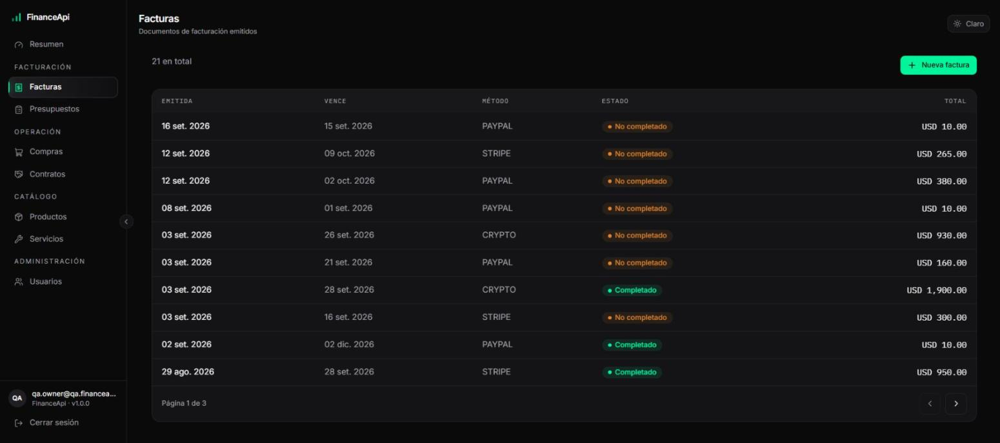
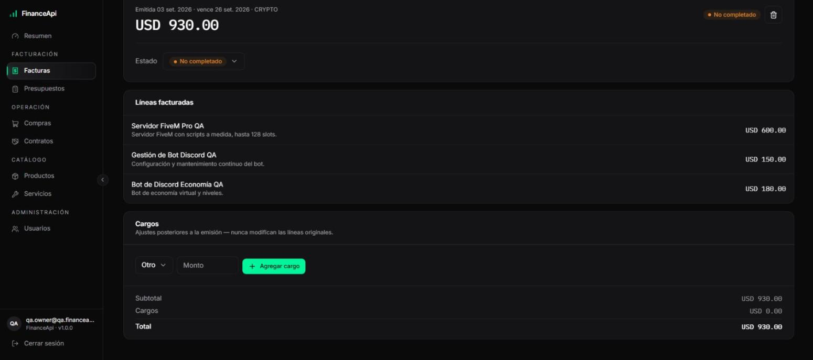
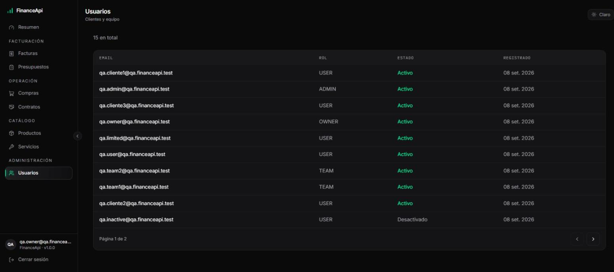
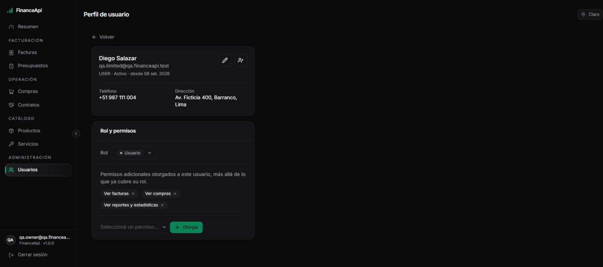
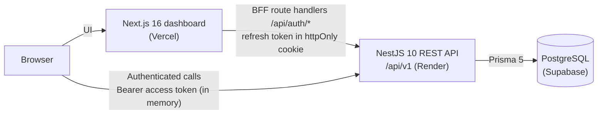

# FinanceApi V3

A full-stack financial management platform: a **NestJS + PostgreSQL** REST API and a **Next.js** dashboard for managing clients, a product and service catalog, purchases, budgets, invoices and service contracts — built around data integrity, strict authorization and safe handling of money.

<p align="center">
  
</p>

<p align="center">
  <a href="https://financeapi-v3-web.vercel.app"><strong>Live application</strong></a> ·
  <a href="https://financeapi-api-m7tt.onrender.com/docs"><strong>API documentation (Swagger)</strong></a> ·
  <a href="./ARCHITECTURE.md"><strong>Architecture</strong></a> ·
  <a href="./SECURITY.md"><strong>Security</strong></a>
</p>

> The API is hosted on Render's free tier, so the first request after a period of inactivity can take a few seconds while the service wakes up.

---

## What I built

FinanceApi covers the day-to-day financial workflow of a small service business: a catalog of products and services, client purchases, quotes (budgets), invoices with post-issuance charges, and service contracts with team assignments — plus an overview dashboard that turns that data into receivables, expected cash flow and portfolio risk.

The goal was not just CRUD. It was to build the parts that are easy to get wrong in a financial system and hard to fix later:

- **Money that never drifts** — every amount is an integer number of cents.
- **Records that don't change after the fact** — prices are snapshotted into line items at transaction time.
- **Retries that don't duplicate payments** — idempotency keys on the payment-critical endpoints.
- **Authorization that is denied by default** — authentication, roles and resource ownership as separate, stacked layers.

This is the third version of the project. The design decisions behind it, including what changed from the previous version, are documented in [`ARCHITECTURE.md`](./ARCHITECTURE.md).

## Product preview

| Sign in | Overview dashboard |
|---|---|
|  |  |

| Invoices | Invoice detail |
|---|---|
|  |  |

| Users and roles | Role and permissions management |
|---|---|
|  |  |

All screenshots are from the live application, taken with a QA account. Most of the visible data comes from the seeded QA dataset (fictitious users under the reserved `qa.financeapi.test` domain); the dashboard aggregates and the invoice list also include a few records from non-QA accounts, shown only as initials and amounts.

## Core features

**Authentication**
- Email/password registration and login, plus Google sign-in (ID token verified server-side).
- Short-lived JWT access tokens and refresh tokens with rotation and reuse detection.
- Frontend auth through a small BFF: the refresh token lives only in an httpOnly cookie; the access token is kept in memory, never in `localStorage`.

**Authorization**
- Four roles: `OWNER`, `ADMIN`, `TEAM`, `USER`.
- A permission catalog with per-user grants on top of the role, stored in the database and managed from the UI. The frontend uses them for navigation; they are not yet enforced on API endpoints (see below).
- Resource ownership: a `USER` can only read and act on their own purchases, budgets, invoices and contracts.
- Role and permission management from the UI (`PATCH /users/:id/role`, `POST`/`DELETE /users/:id/permissions`).

**Financial management**
- Product and service catalog.
- Purchases with price snapshots and payment status.
- Budgets (quotes) with catalog or free-form line items, editable by their owner.
- Invoices with computed totals and post-issuance charges (tax, discount, other) that never modify the original lines.
- Service contracts, either from the catalog or custom, with team assignments.

**Dashboard**
- Receivables (overdue, due soon, collected), expected cash flow, client concentration and overdue aging, a budget → invoice → payment funnel and recent activity — all computed by the API (`GET /dashboard/stats`).
- Month / quarter / year views.

**Product experience**
- Dark and light themes, command palette (`Ctrl+K` / `⌘K`), mobile navigation, loading skeletons, per-section error boundaries and not-found pages.

## Engineering highlights

| Concern | Approach |
|---|---|
| **Money as integer cents** | All amounts are stored and computed as integers (`priceCents`, `unitPriceCents`, …). No floating point anywhere in money arithmetic, which removes rounding errors by construction. |
| **Idempotency keys** | `POST /purchases` and `POST /invoices` accept an optional `Idempotency-Key` header. A retry with the same key and payload returns the stored response without creating a second record; the same key with a different payload is rejected with `409 Conflict`. A scheduled task (`IdempotencyReaperTask`) releases keys left in `PENDING` by an interrupted request. |
| **Transaction snapshots** | Line items store the unit price at the moment of the transaction. Changing a product's price later never rewrites past purchases or invoices. |
| **Prisma transactions** | Multi-table writes (e.g. a purchase and its lines, a budget's line replacement) run inside `prisma.$transaction`, so a failure never leaves orphaned or half-written records. |
| **Computed invoice totals** | Invoices don't store a total. It is computed from lines + charges on every read, so a post-issuance charge can never leave a stale total behind. |
| **JWT authentication** | A global `JwtAuthGuard` protects every endpoint by default; public routes must opt out explicitly with `@Public()`. |
| **Refresh token rotation** | Every refresh issues a new refresh token and invalidates the previous one. Tokens are stored as SHA-256 hashes. Presenting an already-rotated token is treated as theft and revokes every active session of that user. |
| **RBAC** | `@Roles()` + `RolesGuard` restrict administrative operations (issuing invoices, changing statuses, deleting resources). |
| **Fine-grained permissions (groundwork)** | The data model, grant/revoke endpoints, a `@RequirePermissions()` decorator and a global `PermissionsGuard` are in place, but no controller uses `@RequirePermissions()` yet, so permissions don't restrict any endpoint today. Effective endpoint authorization is authentication + roles + ownership. |
| **Resource ownership** | `OwnershipGuard` enforces ownership separately from role, so guessing another resource's ID is not enough to read it. `ADMIN`/`OWNER` bypass is explicit. |
| **Input hardening** | Global `ValidationPipe` with `whitelist` + `forbidNonWhitelisted`: undeclared fields are rejected, which makes mass assignment (e.g. sending `role: "ADMIN"`) structurally impossible. |
| **Observability** | Structured logs with `nestjs-pino`, a per-request correlation ID, and automatic redaction of `authorization`, `cookie`, `password` and `refreshToken`. |

## Architecture



**Request pipeline in the API:** `helmet` → CORS (single explicit origin) → global guards (`ThrottlerGuard` → `JwtAuthGuard` → `RolesGuard` → `PermissionsGuard`) → `OwnershipGuard` on single-resource routes → `ValidationPipe` → controller → service → Prisma. Errors are normalized by a global `AllExceptionsFilter` into a single response shape.

- The API is versioned under `/api/v1`. `GET /health` sits outside the prefix on purpose, for load balancer health checks.
- Row Level Security is enabled with no policies (deny-by-default) on every Supabase table. This closes Supabase's auto-generated REST API, since the application only connects through Prisma.
- Runtime traffic goes through Supabase's transaction pooler; migrations use a direct connection (`DATABASE_URL` vs `DIRECT_URL`).

Full reasoning for each decision: [`ARCHITECTURE.md`](./ARCHITECTURE.md).

## Tech stack

| Layer | Technology |
|---|---|
| API framework | NestJS 10, TypeScript |
| Database | PostgreSQL (Supabase) |
| ORM & migrations | Prisma 5 |
| Authentication | JWT (access + refresh with rotation), Passport, bcrypt, Google Identity (`google-auth-library`) |
| Validation | class-validator, class-transformer |
| API documentation | OpenAPI / Swagger, generated from DTOs by the Nest CLI plugin |
| Security middleware | helmet, `@nestjs/throttler` |
| Logging | Pino (`nestjs-pino`) |
| Scheduling | `@nestjs/schedule` |
| Frontend | Next.js 16 (App Router), React 19, Tailwind CSS 4, shadcn/ui (Radix UI) |
| Testing | Jest |
| CI | GitHub Actions |
| Hosting | Render (API), Vercel (web), Supabase (database) |

## Project structure

```
.
├── apps/
│   ├── api/                       NestJS REST API
│   │   ├── prisma/
│   │   │   ├── schema.prisma      data model (money in cents, soft deletes, indexed FKs)
│   │   │   ├── migrations/        versioned SQL migrations
│   │   │   ├── seed.ts            permission catalog + bootstrap OWNER user
│   │   │   └── seed-qa.ts         optional QA dataset (fictitious users and documents)
│   │   └── src/
│   │       ├── auth/              register, login, Google sign-in, refresh rotation, logout
│   │       ├── users/             profiles, roles and permission grants
│   │       ├── products/          product catalog
│   │       ├── services/          service catalog
│   │       ├── purchases/         transactional purchases with price snapshots
│   │       ├── budgets/           quotes with catalog or free-form lines
│   │       ├── invoices/          invoices, computed totals, post-issuance charges
│   │       ├── service-contracts/ contracts and team assignments
│   │       ├── dashboard/         read-only aggregate stats for the overview page
│   │       ├── common/            guards, decorators, idempotency interceptor, tasks, exception filter
│   │       └── prisma/            PrismaService (single client instance)
│   └── web/                       Next.js dashboard
│       ├── app/                   routes: /login, /register, /dashboard/*, BFF /api/auth/*
│       ├── components/            UI components (shadcn/ui based)
│       └── lib/                   API client, formatting, navigation and permission helpers
├── docs/                          README demo and screenshots
├── .github/workflows/ci.yml       CI pipeline
├── render.yaml                    Render blueprint for the API
├── ARCHITECTURE.md
└── SECURITY.md
```

## Running locally

**Requirements:** Node.js 20+ and a PostgreSQL database (the project uses Supabase; any PostgreSQL instance works for local development).

Each app has its own `package.json` and `package-lock.json` and is installed with `npm`, the same way CI and Render install it.

### 1. API

```bash
cd apps/api
cp .env.example .env
```

Fill in `.env` (every variable is documented in [`apps/api/.env.example`](./apps/api/.env.example)):

| Variable | Purpose |
|---|---|
| `DATABASE_URL` | Runtime connection (Supabase transaction pooler, port 6543) |
| `DIRECT_URL` | Direct connection used by migrations and seeds (port 5432) |
| `JWT_ACCESS_SECRET`, `JWT_REFRESH_SECRET` | Token signing secrets |
| `JWT_ACCESS_EXPIRES_IN`, `JWT_REFRESH_EXPIRES_IN` | Token lifetimes |
| `CORS_ORIGIN` | Allowed frontend origin (defaults to `http://localhost:3000`) |
| `PORT` | API port (defaults to `5050`) |
| `GOOGLE_CLIENT_ID`, `GOOGLE_CLIENT_SECRET` | Google sign-in |
| `SEED_OWNER_EMAIL`, `SEED_OWNER_PASSWORD` | Bootstrap OWNER account created by the seed |

Then:

```bash
npm install
npx prisma generate
npx prisma migrate deploy   # apply the schema
npx prisma db seed          # permission catalog + bootstrap OWNER user (the only way to create the first admin)
npm run start:dev           # http://localhost:5050
```

- Swagger UI: `http://localhost:5050/docs`
- Health check: `GET http://localhost:5050/health`
- Optional sample data: `npm run prisma:seed:qa` loads the QA dataset from `prisma/seed-qa.ts`. It is never run automatically — only use it against a development database.

### 2. Web

Create `apps/web/.env.local`:

```bash
API_URL="http://localhost:5050/api/v1"                  # used only by the BFF route handlers
NEXT_PUBLIC_BACKEND_URL="http://localhost:5050/api/v1"  # used by the browser (must match CORS_ORIGIN)
NEXT_PUBLIC_GOOGLE_CLIENT_ID="your-client-id.apps.googleusercontent.com"
```

```bash
cd apps/web
npm install
npm run dev                 # http://localhost:3000
```

More details in [`apps/web/README.md`](./apps/web/README.md).

## Testing

```bash
cd apps/api
npm test                    # unit tests — Prisma is mocked, no database required
npm run test:cov            # with coverage
npx eslint "src/**/*.ts"    # same lint command as CI (npm run lint also applies --fix)
npm run build
```

The suite (13 test suites, 78 tests) focuses on the business logic that matters in a financial domain rather than framework boilerplate: refresh token rotation and reuse detection, price snapshots and total calculation, transactional rollback on invalid line items, the role / permission / ownership guards, the idempotency interceptor and the dashboard aggregations.

The frontend has no automated tests. It provides lint and build scripts:

```bash
cd apps/web
npm run lint
npm run build
```

## CI

[GitHub Actions](./.github/workflows/ci.yml) runs on every push and pull request to `feat/finance-api-complete`:

1. `npm ci`
2. `npx prisma generate`
3. `npx eslint "src/**/*.ts"`
4. `npm run build`
5. `npm run test -- --coverage=false`

All steps run in `apps/api`: the pipeline currently covers **only the API**. The web app (`apps/web`) is not part of CI yet.

No database credentials are needed in CI: `prisma generate` only reads the schema, and the tests mock Prisma entirely.

## Security

- Passwords hashed with bcrypt (12 rounds); refresh tokens stored only as SHA-256 hashes.
- Default-deny authorization with role and ownership checks.
- `helmet`, a single explicit CORS origin, strict request validation.
- Global rate limiting, with a stricter limit on the login endpoints.
- Row Level Security enabled (deny-by-default) on every table.
- Secrets redacted from logs automatically.

[`SECURITY.md`](./SECURITY.md) contains a self-review against the OWASP API Security Top 10 (2023), including the known gaps that are still open.

## Architecture documentation

[`ARCHITECTURE.md`](./ARCHITECTURE.md) covers the main technical decisions and their trade-offs: why NestJS 10, money in cents, token rotation, the per-module domain rules (purchases, budgets, invoices, contracts), idempotency, logging, database connection strategy and the frontend auth design.

## Project status

- **Backend:** all domain modules (auth, users, products, services, purchases, budgets, invoices, service contracts, dashboard) are implemented, with RBAC and permission management. Unit tests cover the core business logic and the authorization layer.
- **Frontend:** list, detail, create, edit and delete flows according to each module's permissions (users sign up through registration, so there is no user-creation screen), role-aware navigation and the overview dashboard, connected to the API.
- **Deployment:** the web app runs on Vercel and the API on Render, backed by Supabase.
- **Open items:** tracked in the "Known gaps" section of [`SECURITY.md`](./SECURITY.md).

## Author

**Miler Castro Martínez**

- GitHub: [@Devmillerr](https://github.com/Devmillerr)
- LinkedIn: [linkedin.com/in/devmillerr](https://linkedin.com/in/devmillerr)
